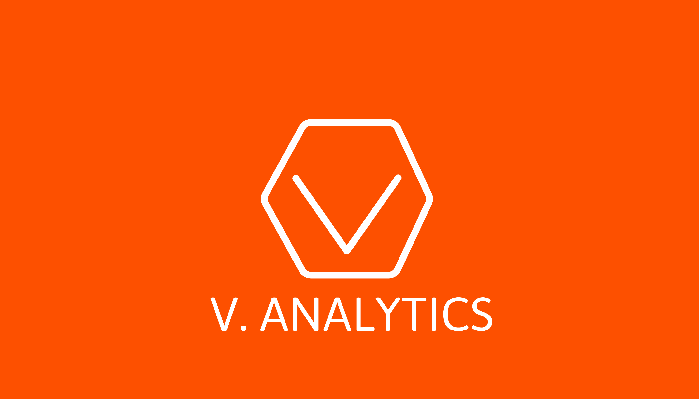
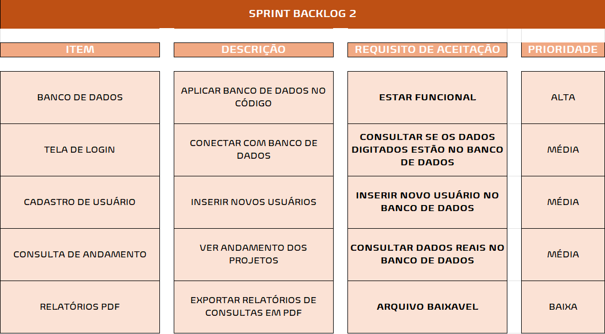
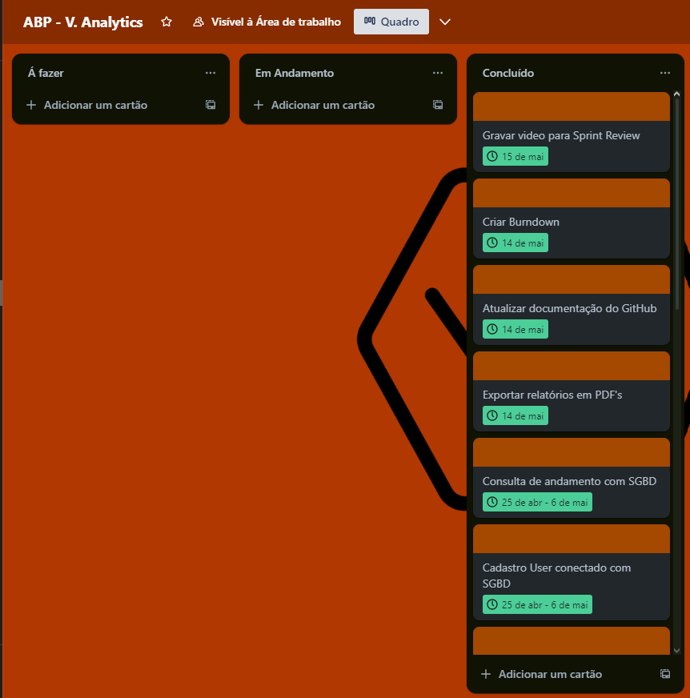

  

<h1  align="center">Sprint 1: 25/03/2024 a 18/04/2024</h1>

<a  href="#objetivos">Objetivos da sprint</a> &nbsp |&nbsp &nbsp
<a  href="#entregas">Entregas</a> &nbsp |&nbsp &nbsp
<a  href="#sprint_backlog">Sprint Backlog 1</a> &nbsp |&nbsp &nbsp
<a  href="#wireframe">Wireframe</a> &nbsp |&nbsp &nbsp
<a  href="#kanban">KanBan</a> &nbsp |&nbsp &nbsp 
<a  href="#metricas">Métricas do time</a> &nbsp |&nbsp &nbsp 
<a  href="#sprint_retrospectiva">Sprint Retrospectiva</a>

<a href="">Voltar para Documentação<a>
 

  

 
  
:movie_camera: Vídeo sobre a 2ª sprint <a href="https://www.youtube.com/">***aqui***</a>  

 

Nesta segunda sprint, nossa equipe focou na implementação do banco de dados real e no desenvolvimento do back-end do software de gerenciamento de projetos para Geoprocessamento. Com essas adições, conseguimos habilitar a funcionalidade de exportação de relatórios em PDF, permitindo que os gestores de equipe visualizem e compartilhem informações facilmente.

   

## :dart: Objetivos da Sprint

Os requisitos definidos pela equipe abrangidos por essa sprint são:

  

- :heavy_check_mark: **1:** Criação e aplicação do Banco de Dados;

- :heavy_check_mark: **2:** Realizar o login com consulta ao BD;

- :heavy_check_mark: **3:** Cadastrar o usuário no BD;

- :heavy_check_mark: **4:** Realizar consultas reais no BD;

- :heavy_check_mark: **5:** Exportar consultas em .pdf;

- :heavy_check_mark: **6:** Elaboração da Documentação e organização no GitHub

- :heavy_check_mark: **7:** Apresentação

 

## 📲 Entregas

Na entrega da Sprint 2, criamos parcialmente o back-end do produto. 

Implementamos funcionalidades solicitadas pelo cliente, como o cadastro de usuários, consulta de desempenho da equipe e a capacidade de exportar relatórios em PDF.
  

### 1: Criação e aplicação do Banco de Dados

  

Implementação de um banco de dados funcional fornecido pelo cliente, modelado na Sprint passada, para armazenar informações do projeto.

  

### 2: Realizar o login com consulta ao BD

  

Implementação de um sistema de login que verifica as credenciais do usuário no banco de dados.

  

### 3: Cadastrar o usuário no BD

  

Desenvolvimento de funcionalidade para cadastrar novos usuários no banco de dados.

### 4: Realizar consultas reais no BD

  

Implementação de consultas eficazes no banco de dados para obter informações relevantes.

### 5: Exportar consultas em .pdf

Desenvolvimento da capacidade de exportar consultas realizadas para um formato PDF.

### 6: Elaboração da documentação e organização no GitHUB

  

Preparação e organização de documentação abrangente do projeto, além de garantir uma estrutura organizada no GitHub.

### 7: Apresentação

  

Apresentação para o cliente (Sprint Review)

→ [Voltar ao topo](#topo)

  

## :clipboard: Sprint Backlog 1

A Sprint Planning foi realizada no dia 23/04/2024, gerou os artefatos para o backlog abaixo:

      
       

→ [Voltar ao topo](#topo)

 

## :rice_scene: Exportação em .pdf

      
       
      

→ [Voltar ao topo](#topo)

 

##  :bar_chart: Trello

      
       

→ [Voltar ao topo](#topo)

 

## :chart_with_upwards_trend: Métricas do time

Nesta sprint o time se uniu para as entregas de cada item listado na backlog da sprint.

- Abaixo se encontra o gráfico Burndown gerado pela equipe nesta sprint, onde o eixo X são os dias trabalhados e o eixo Y representa as entregas de cada dia:

→ [Voltar ao topo](#topo)

 

## :bulb: Sprint Retrospectiva

- ### O que funcionou bem?
  - Apesar dos desafios com o time, conseguimos nos adaptar às mudanças e continuar avançando com o projeto;
  - Trabalho e apoio em equipe;
  - Compreensão.
  
- ### O que pode melhorar?
  - Realização das tarefas dentro do prazo estipulado;
  - Divisão e gestão de tarefas.

→ [Voltar ao topo](#topo)
